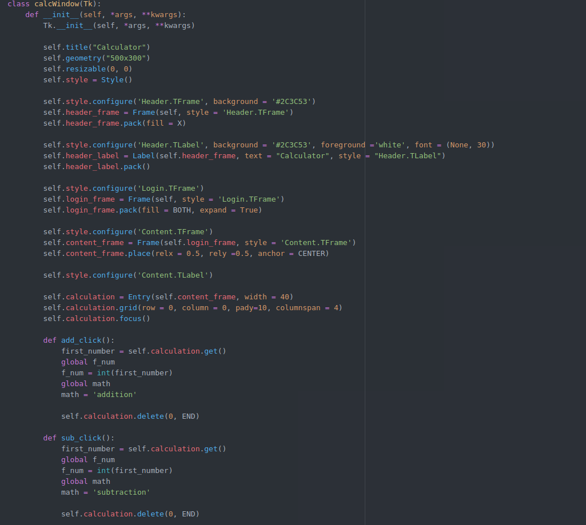
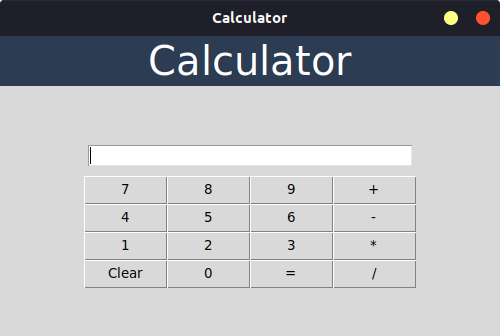

# tkinter Calculator
This is a simple GUI calculator made using python library called tkinter. 

## Motivation
This was one of the tasks for 'Patel Hall Software Team'. This project is just to re-familiarize myself with python tkinter library.

## Code Style
This project uses the object oriented approach to tkinter. As can be seen in the following screenshot:

## How to use? / Installation
First you would have to ensure you have python3 and tkinter installed in your pc. If not, follow the following points:

1. to install python3 run the following script: 
        <pre>sudo apt install python3</pre>

2. After python3 installation is complete, run this script in your terminal to install tkinter: 
        <pre>sudo apt install python3-tk</pre>

- To ensure that everything has been installed correctly - write **python3** in terminal to open the python shell in the terminal. 

- after the **>>>** write 
        <pre>import Tkinter</pre> 
and then press enter. Follow this by 
        <pre>Tkinter.Tk()</pre> 
this would open a simple GUI window without any title or text. 

If you get the mentioned results without any errors, you have successfully installed python3 and tkinter. Now:

1. Clone the respository. 

2. Run **main.py** using the script:
        <pre>python3 main.py</pre>
        

3.You would be able to use the calculator now.
